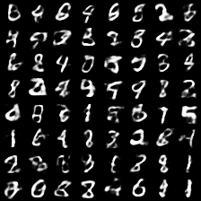
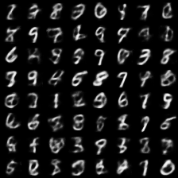

# Overview

Experiments involving VAEs with discrete latent representations. Findings are [here](notebooks/plots.ipynb).

- Samples when model is trained with the KL term evaluated using Gumbel-Softmax distributions: 
- Samples when model is trained with the KL term evaluated using Categorical distributions: 
